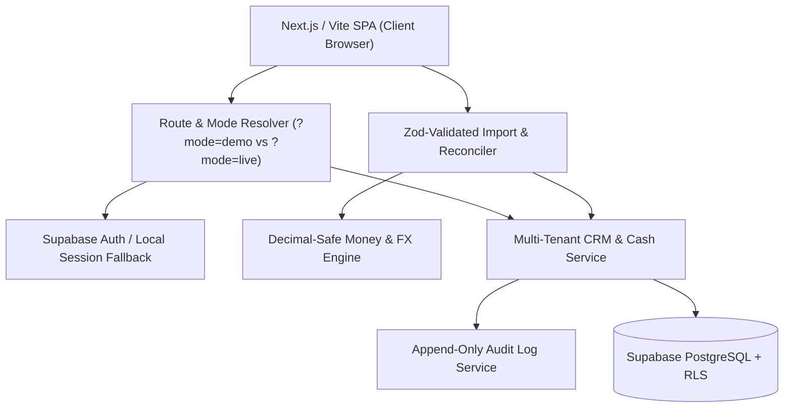

# DataBeta Architecture Specification

DataBeta is a **Sales & Cash Operating System** designed specifically for owner-led businesses with 2–25 people. It is engineered with strict multi-tenancy, deterministic financial calculations, auditable provenance, and immutable separation between demo and real workspaces.

---

## 1. System Architecture Overview



---

## 2. Multi-Tenant Isolation Model

### Tenant Separation Invariant
- **Demo Workspace (`demo-workspace-id`)**:
  - A fixed, immutable tenant.
  - Initialized strictly when `window.location.search` contains `?mode=demo` or `/demo`.
  - Mutating state in demo mode is strictly in-memory or session-isolated and NEVER writes to authenticated user data.
  - Persistent In-App Demo Banner: `"Demo workspace — changes are not saved to your business data."`
- **Real Workspaces (`biz-[uuid]`)**:
  - Authenticated multi-tenant PostgreSQL rows protected by Row-Level Security (`RLS`).
  - Auto-provisioned for new authenticated accounts with clean zero-state.
  - All database queries filter strictly via `business_id IN (SELECT get_user_business_ids())`.
  - Data is canonically rehydrated on reload or route change. Real accounts never fall back to static seed data.

---

## 3. Financial Invariant Principles

1. **Non-Negotiable Provenance Envelope**:
   - Every KPI (Pipeline Value, Cash Outlook, Collections Due) must declare:
     - `status`: `'complete' | 'provisional' | 'needs_data'`
     - `coverage`: Record count, date boundaries, and list of missing inputs.
     - `assumptions`: Explicit financial assumptions.
2. **Zero-Division & Floating-Point Safety**:
   - Win rates and margin formulas explicitly protect against zero denominators by returning `'needs_data'` rather than `NaN` or `Infinity`.
   - Money parsing strips currency formatting (`₹`, `$`, `€`, `£`, commas) and parses accounting parentheses `(1,500)` into `-1500`.
   - Invalid numeric strings return `null` and are flagged for user review rather than silently coerced to `0`.
3. **Multi-Currency Record Integrity**:
   - Every monetary transaction preserves:
     - `originalAmount` & `originalCurrency`
     - `baseAmount` & `baseCurrency`
     - `fxRate` & `fxRateDate`
     - `conversionSource` (`'identical'` | `'reference_fx'` | `'custom_rate'`).
   - Mixed-currency records are never summed without explicit conversion to the workspace base currency.

---

## 4. Entity Lifecycle & Mutation Pipeline

```
Lead / Contact (Decision Maker)
       │
       ▼
Deal (Title, Stage, Amount, Expected Close Date, Next Step)
       │
       ▼
Daily Follow-up Task (Priority, Due Date, WhatsApp Script)
       │
       ▼
Proposal / Won Deal
       │
       ▼
Invoice & Receivables (Invoice #, Due Date, Balance Due)
       │
       ▼
Collection & Reconciled Cash Impact
```

Every state mutation in this lifecycle records an immutable audit log entry in `auditService` with actor metadata, timestamp, and before/after summaries.
